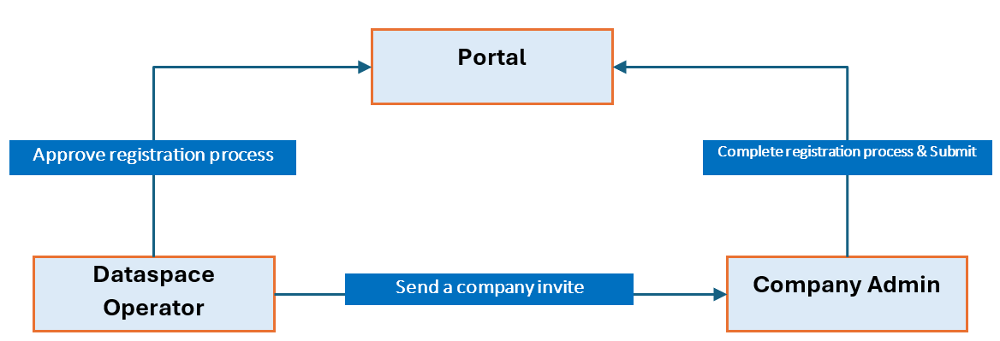
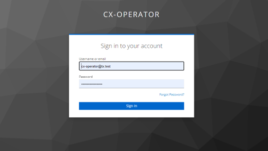
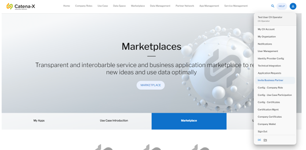
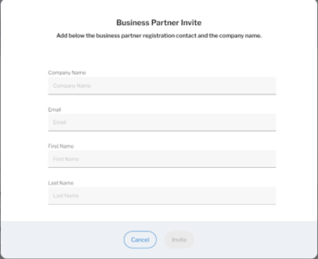
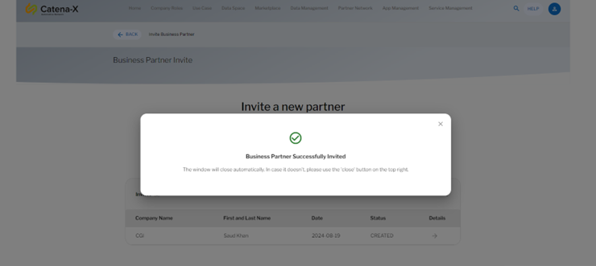

# Step by Step Company Onboarding Process

This guide explains the three simple steps required get a company onboarded in the dataspace environment.

Here is the overiew:

### Roles:
* Dataspace Operator (Inviter)
* Company Admin (Invitee)

The following mandatory checklist must be fulfilled to be a part of the data space:
    * Data Validation
    * BPN Creation
    * Identity Wallet Creation
	* Clearing House
	* Self Description
	* Application Activation
*	Participant must fulfill these checks
*	Dataspace operator must approve these checks once validated

## STEP 1: Send a Company Invite

This step invloves sending a company invitation initiated by the data space operator to the company admin.

- Login using CX-Operator company and credentials

**Credentials:**

    - Company Selection: CX-Operator
    - Username: cx-operator@tx.test
    - Password: tractusx-umbr3lla!

- Invite a Business Partner to the company admin

- Click on the “Invite” button and fill out the necessary details and send invitation to the company admin

If this step is completed, follow [STEP 2: Registration](./02_Registration.md)