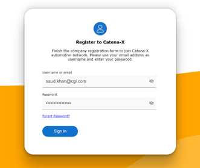
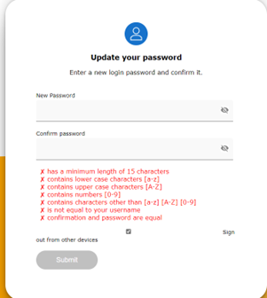
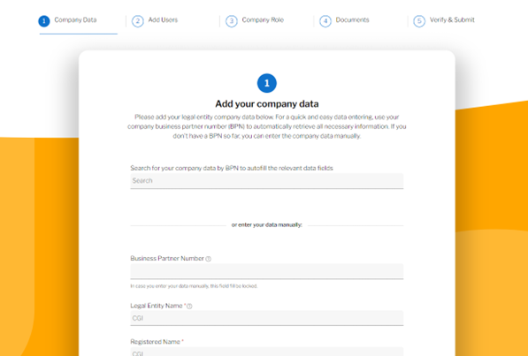
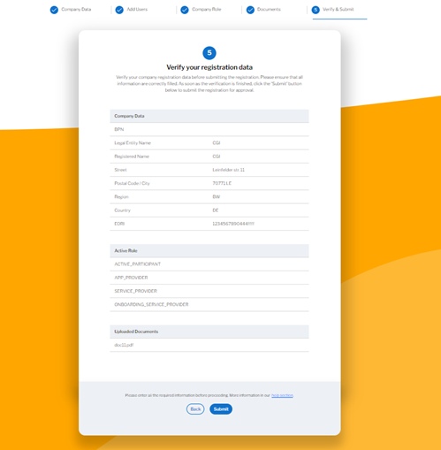
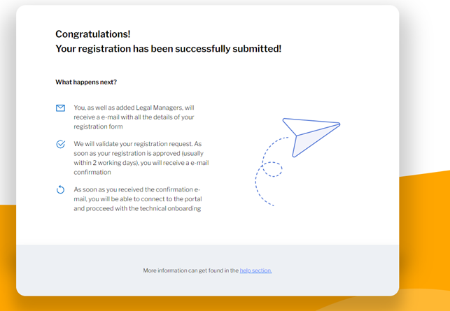

## STEP 2: Complete Registration process and Submit

This step invloves filling out registration form and submit it to the operator. It is performed by the company admin.

- Company admin should receive two emails separately: invitation email and One Time Password (OTP). 

- Click on the above “Register your Company” link and select your company, and login with the provided OTP from second email.

- After login, you will be asked to update your Password.

Click on **Lets get started**

- Fill out the company registration form and add company users if necessary. At least, verify and submit the form.

After submission, you will receive this message.

If [step 1](./01_Invitation.md) and [step 2](./02_Registration.md) are completed, follow [STEP 3: Approval](./03_Approval.md)