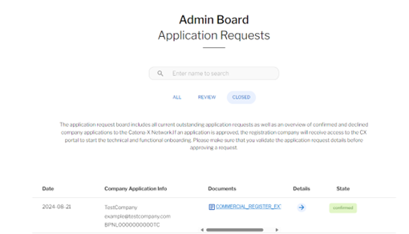
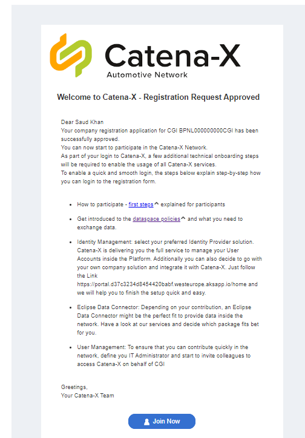

# Technical Steps to bypass external components

## Purpose
This guide is used to follow the steps to bypass the external components (Clearing House and Self Description) during the company onboarding process in the dataspace environment.

## Steps

* Login to pgAdmin:
    - url: https://pgadmin4.d37c3234d8454420babf.westeurope.aksapp.io/
    - username: pgadmin4@txtest.org
    - password: tractusxpgdamin4

* Connect a Server
    - Host: portal-backend-postgresql
    - Username: postgres
    - Password: dbpasswordportal
    - Port: 5432

* Open SQL editor and execute below sql query:

```sql
WITH applications AS (
    SELECT distinct ca.id as Id, ca.checklist_process_id as ChecklistId
    FROM portal.company_applications as ca
             JOIN portal.application_checklist as ac ON ca.id = ac.application_id
    where ca.application_status_id = 7 and ac.application_checklist_entry_type_id = 6 and ac.application_checklist_entry_status_id = 1
),
updated AS (
 UPDATE portal.application_checklist
     SET application_checklist_entry_status_id = 3
     WHERE application_id IN (SELECT Id FROM applications)
     RETURNING *
)

INSERT INTO portal.process_steps (id, process_step_type_id, process_step_status_id, date_created, date_last_changed, process_id, message)
SELECT gen_random_uuid(), 12, 1, now(), NULL, a.ChecklistId, NULL
FROM  applications a;
```

```sql
UPDATE portal.process_steps
	SET process_step_status_id=2, date_last_changed=now()
	WHERE process_step_type_id = 7 and process_step_status_id = 1 and process_id = (select distinct checklist_process_id from portal.company_applications where application_status_id = 7);

```

Wait for some minutes (approx. 5 mins) until the **process worker** job gets triggerd to execute further steps. Alternatively, the job could also be triggered manually in Azure.


The dataspace operator can see the status as confirmed!




The company admin should recieve a welcome email **Welcome to Catena-X - Registration Request Approved** and should be able to access the Catena-X portal.




### Sources: 

-	https://github.com/eclipse-tractusx/portal-backend/issues/819
-	https://github.com/eclipse-tractusx/tractus-x-umbrella/tree/main/charts/umbrella
-	https://github.com/eclipse-tractusx/portal-assets/blob/main/docs/developer/01.%20Registration/04.%20Registration%20Approval/03.%20Registration%20Approval%20Process.md#details-activation


**Congratulations! You have completed the company onboarding process successfully!** 

If you want to enable data exchange between two onboarded companies, you first need to configure BPNs for both EDCs. For more information see [section 5](./05_Data_Exchange.md)


