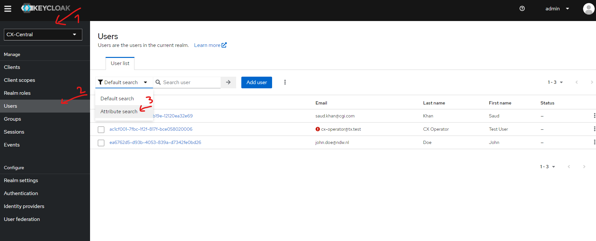
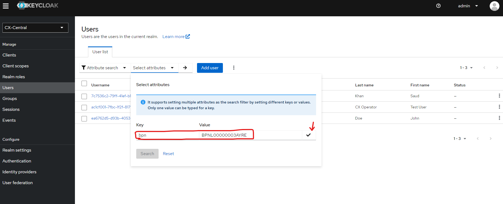
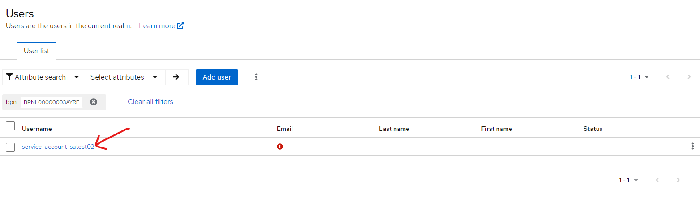
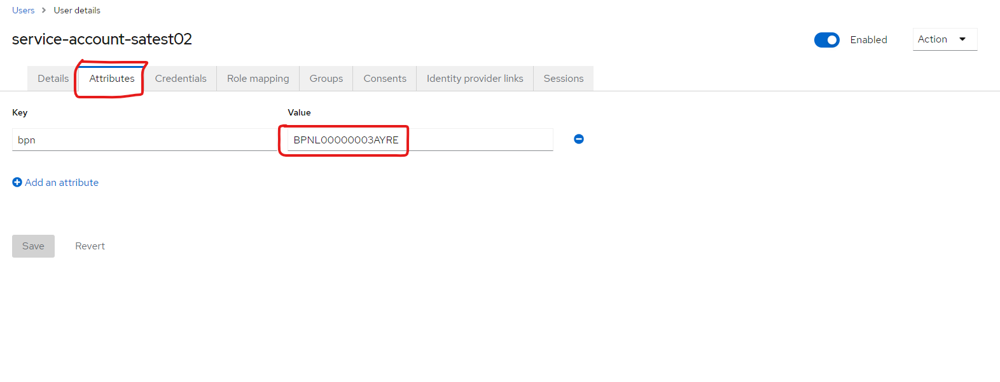

# Data Exchange

## Purpose
This document describes the technical requisites to enable data exchange between two onboarded companies in the dataspace environment. This is performed by Dataspace operator.


## Steps

### Login using CX-Operator company and credentials

- Keycloak url: https://centralidp.d37c3234d8454420babf.westeurope.aksapp.io/auth/
- Username: admin
- Password: adminconsolepwcentralidp


### Configure BPNs
- After onboarding process has been completed, configure BPNs for data consumer and data provider parties.

#### Example BPNs:
* Provider EDC: BPNL000000000NDW
* Consumer EDC: BPNL000000000CGI









Replace `BPNL00000003AYRE` to the new BPN (Example: BPNL000000000NDW)

### Configure EDCs with new BPN settings

- Set BPNs to the EDC configuration and restart the EDCs helm deployment to reflect the changes

```bash
# 1. Change to the umbrella directory
# 2. Run the following command 
helm upgrade --debug umbrella -f values.yaml .
```

Wait for some seconds until the helm charts are deployed successfully.

Repeat same steps for both EDCs.