# NAPCORE Dataspace Architecture

- [NAPCORE Dataspace Architecture](#napcore-dataspace-architecture)
  - [Introduction](#introduction)
  - [Dataspace Roles](#dataspace-roles)
    - [Data Consumer](#data-consumer)
    - [Data Provider](#data-provider)
    - [Dataspace Operator](#dataspace-operator)
  - [Dataspace Components](#dataspace-components)
    - [Component Interaction Diagram](#component-interaction-diagram)
    - [Component Dependency Graph](#component-dependency-graph)
    - [Airflow Pipeline](#airflow-pipeline)
      - [Pipeline Overview](#pipeline-overview)
    - [Simple Data Service](#simple-data-service)
    - [Metadata Registry](#metadata-registry)
      - [NTM Backend](#ntm-backend)
      - [NTM Frontend](#ntm-frontend)
        - [Metadata Offer](#metadata-offer)
    - [Tractus-X Eclipse Dataspace Connector](#tractus-x-eclipse-dataspace-connector)
    - [Tractus-X Portal](#tractus-x-portal)
    - [Federated Keycloak](#federated-keycloak)
    - [Managed Identity Wallet](#managed-identity-wallet)
    - [Negotiation Wrapper Frontend](#negotiation-wrapper-frontend)
      - [1º- Initiate the Contract Negotiation](#1º--initiate-the-contract-negotiation)
      - [2º- Policy Selection](#2º--policy-selection)
      - [3º- Start Negotiation](#3º--start-negotiation)
      - [4º- Transfer to get token](#4º--transfer-to-get-token)
      - [5º- Use token to get the data](#5º--use-token-to-get-the-data)
      - [6º- Download the data in JSON format](#6º--download-the-data-in-json-format)

## Introduction

The NAPCORE Mobility Dataspace is an experimental dataspace built using the [Eclipse Tractus-X™](https://github.com/eclipse-tractusx) components. More specifically for building and allowing the data exchange in between the different parties of the data space and to ease the deployment of the components the [Tractus-X Umbrella™](https://github.com/eclipse-tractusx/tractus-x-umbrella) was used.

This mobility dataspace architecture is based on the [Fraunhofer Mobility Data Space](https://www.dataspaces.fraunhofer.de/de/vertikalisierungen/mobility_data_space.html) whitepaper which was used to build the [Mobilithek Data Space](https://mobilithek.info/) for the german industry.

NAPCORE offers a [Metadata Registry](#metadata-registry) platform for the Netherlands mobility industry, which enables the search for data offers available in the Data Space. The data exchange is then powered by the [Tractus-X Eclipse Dataspace Connector™](#tractus-x-eclipse-dataspace-connector), which enables the data sovereighty between [data consumer](#data-consumer) and [data provider](#data-provider). The netowork services and shared services  like the [Tractus-X Portal™](#tractus-x-portal), the [Federated Keycloak](#federated-keycloak) and the [Tractus-X Managed Identity Wallet](#managed-identity-wallet) are hosted and administrated by the [Dataspace Operator](#dataspace-operator).

Additionally a [Airflow Pipeline](#airflow-pipeline) was developed to ease the external data extraction from dataspaces like [Mobilithek](https://mobilithek.info/). For the [data consumers](#data-consumer) an demontration application was also created, which can interact with their company EDC consumer and retrieve the data from it.

The platform selected to deploy all the data is [Azure Kubernetes Service (AKS)](https://azure.microsoft.com/de-de/products/kubernetes-service/), however any other platform that support kubernetes can be used.

## Dataspace Roles

### Data Consumer

A **data consumer** retrieves data using an [Eclipse Dataspace Connector](#tractus-x-eclipse-dataspace-connector), by selecting an specific offer listed in the catalog of a [data provider](#data-provider) and accepting a available policy.

For easing the data retrieval process, the negotiation is done by a [Negotiation Wrapper Frontend](#negotiation-wrapper-frontend). For finding where the [data provider](#data-provider) EDCs are and which offers are available, the **data consumer** will search at the [Metadata Registry](#metadata-registry), which contains the essential information for differentiating and specifying the data offers available, working as a federated catalog user interface.

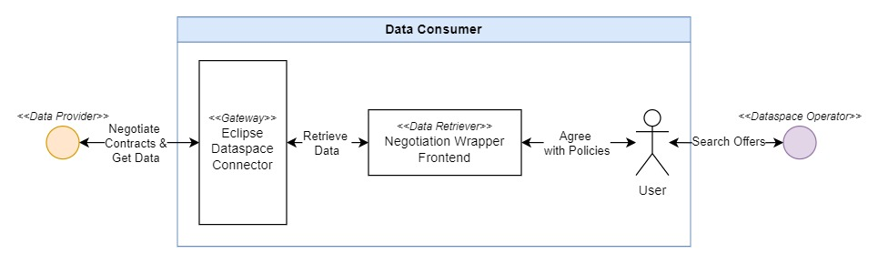

### Data Provider

The **data provider** will configure the external data endpoints in the [Airflow Pipeline](#airflow-pipeline) which will transform the data format from DATEX into OTM format, storing both input datas in the [Simple Data Service](#simple-data-service) where it will be persisted.

For [data consumers](#data-consumer) to find the available data offers, the **data provider** will configure the rules and policies in the [Airflow Pipeline](#airflow-pipeline) so that the correct information is registered in the [Eclipse Dataspace Connector](#tractus-x-eclipse-dataspace-connector).

Last but not least the [Airflow Pipeline](#airflow-pipeline) will register the metadata, edc endpoint and offer id in the [Metadata Registry](#metadata-registry) so it can be found by the [data consumers](#data-consumer).

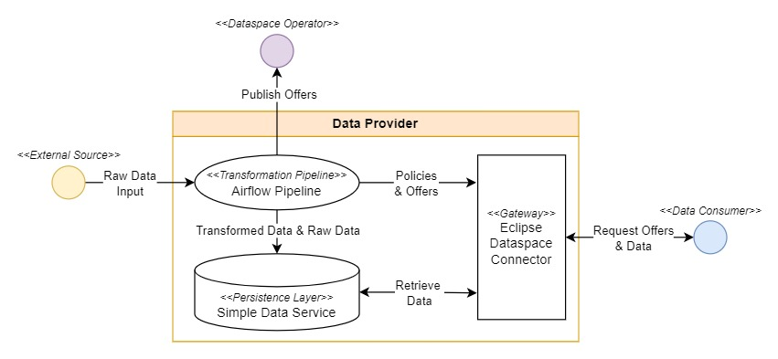

### Dataspace Operator

The **dataspace operator** is a provider of shared services and acts as a **Policeman** in the network, making sure all the members of the network are real companies and are allowed to exchange or access data in the dataspace.

A [Portal](#tractus-x-portal) is provided for the members of the network to onboard their companies and obtain the necessary credentials to register their [Eclipse Dataspace Connectors](#tractus-x-eclipse-dataspace-connector). The portal is responsible to configure two other important components the [Federated Keycloak](#federated-keycloak) and the [Managed Identity Wallet](#managed-identity-wallet).

The [Managed Identity Wallet](#managed-identity-wallet) component receives the company credentials and limits the transfer and access of the participants in the network, depending on the agreed use cases signed.

The [Federated Keycloak](#federated-keycloak) provides the uses the access rights to the portal and to the central services like the [Managed Identity Wallet](#managed-identity-wallet), allowing the EDC of the participants to issue and verify company credentials and policy constraints.

The **dataspace operator administrator** is responsible to configure the IAM and the Portal correctly so that the different members receive an email invitation to join the network.

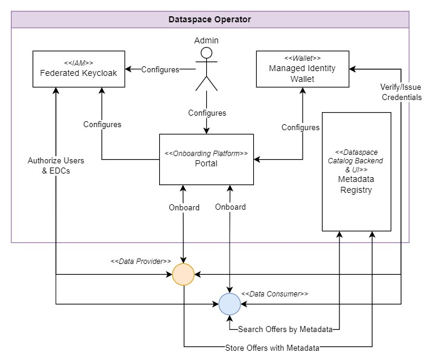

## Dataspace Components

The [Eclipse Tractus-X™](https://github.com/eclipse-tractusx) components, are enought to provide a minimal viable data exchange between the two EDCs. For this mobility use case additional software components were needed to fullfill the desired functinalities. For example, that the data consumers find the offer information (metadata) in a central platform which indicates where the EDC and data is located with each policy.

### Component Interaction Diagram

Here we can visualize a component interation diagram showing how the different systems interact with each other.

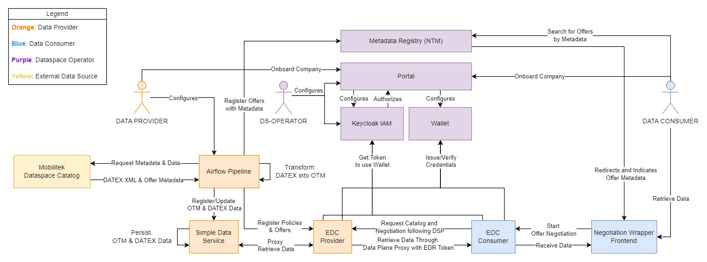

### Component Dependency Graph

Here we can visualize the dependencies in between the [Eclipse Tractus-X™](https://github.com/eclipse-tractusx) components and the new components of the NAPCORE dataspace.

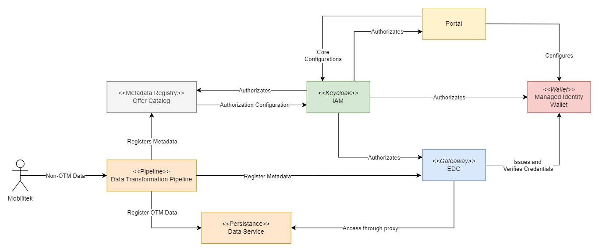

### Airflow Pipeline

The [Apache Airflow®](https://airflow.apache.org/) is a platform that provides an easy way of configuring DevOps workflows. Allowing the DepOps engineers to program using [Python](https://www.python.org/) complex pipelines with multiple steps each.

It was used to reduce the complexity and time of the pipeline configuration. It is responsible for the following actions:

1. **Actively retrieving data and metadata from external data endpoints from Mobilithek.**
2. **Transforming incomming data from DATEX format to OTM format.**
3. **Storing both DATEX and OTM data into the [simple data service](#simple-data-service).**
4. **Registering and Updating Data Offers Metadata in the [Metadata Registry](#metadata-registry).**
5. **Registering and Updating Data Offers and Policies in the [Eclipse Dataspace Connector](#tractus-x-eclipse-dataspace-connector).**

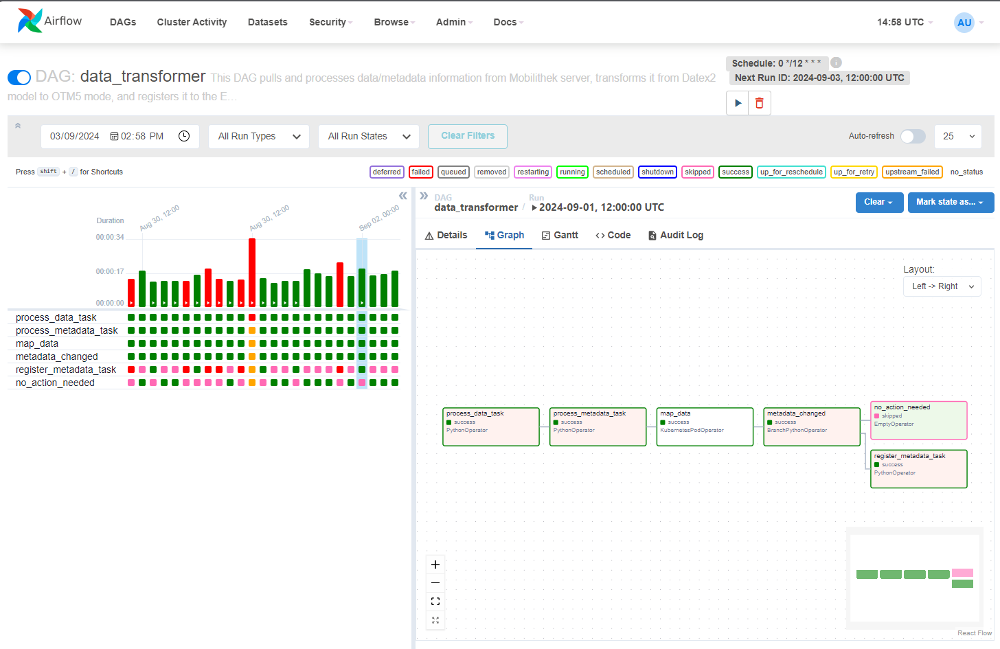

#### Pipeline Overview

The pipeline shall update the data and metadata every 12 hours if it has changed, therefore a hash comparation logic was implemented. The hashes are stored in the [simple data service](#simple-data-service) and are compared with the incomming uploaded data in the external data sources. In this way a minimal effort is applied when comparing if the data has changed or not, reducing the processing time of the pipeline and therefore reducing the price at the Azure infrastructure.

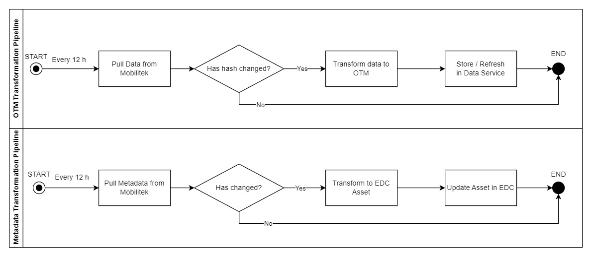

More information and details about how the pipeline was build, can be found at the [Data Transformation Pipeline](../data-transformation-pipeline.md).

### Simple Data Service

The [Simple Data Backend Service](../../simple-data-backend/) allows the [data provider](#data-provider) to store information regarding the data and the metadata associated with the offers registered in the [Eclipse Dataspace Connector](#tractus-x-eclipse-dataspace-connector).

Its main purpose is to:

1. Store the hash information of the data stored, so it can be compared with the uploaded version incomming from the external data source. In this way knowing if it has changed or not with minimal effort.
2. Store the data associated with the offer. In this way when the consumer concludes the negotiation, the [Eclipse Dataspace Connector](#tractus-x-eclipse-dataspace-connector) dataplane will proxy the **simple data service** api that will retrieve the data o the [data consumer](#data-consumer).
3. Store a copy of the metadata associated with the offer and registered in the [Metadata Registry](#metadata-registry).

### Metadata Registry

The **metadata registry** is build of two components, an backend which has different APIs with CRUD operations and a frontend which allows users to access public metadata. The UI allows users to search for specific parameters and tags from the metadata, allowing the users to identify the correct offer and visualize how many times it was downloaded.

The **NTM Mobility Data Registry** (in Dutch `Nationaal Toegangspunt Mobiliteitsdata Register`) is the software used to register the metadata. It was provided by the NAPCORE portal and has the capability of storing the necessary information and searching for the components.

#### NTM Backend

The NTM backend allows the users to use APIs and update their metadata offers and access to the data:

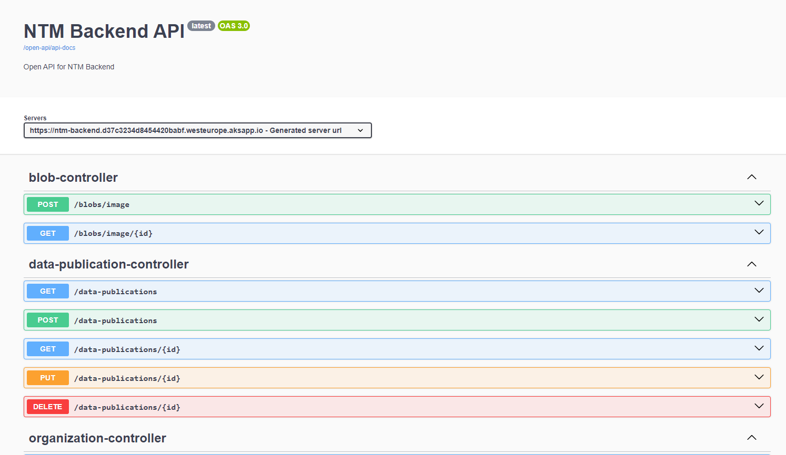

#### NTM Frontend

In the NTM frontend the user is able to search and access the metadata information:

##### Metadata Offer

If the user wants to access the offer it will click in the button included in the offer view ("See publication"):

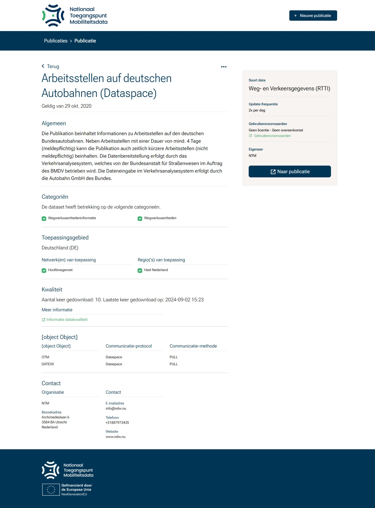

In the offer you will be able to see how many downloads have been made and also the different data formats available.

### Tractus-X Eclipse Dataspace Connector

The [**Eclipse Tractus-X™ Dataspace Connector**](https://github.com/eclipse-tractusx/tractusx-edc) is an esencial component for the Tractus-X Dataspace. It is the main gateway to the network, it allows [data consumers](#data-consumer) to access information from [data providers](#data-provider) maintaining the data sovereignty at all times.

### Tractus-X Portal

The [**Eclipse Tractus-X™ Portal**](https://github.com/eclipse-tractusx/portal) is a shared component which allows the Catena-X Network uses to onboard their companies in the network.

The onboarding process is described in different steps:

1. [**Invitation**](../01_Invitation.md): Allows the [Dataspace Operator](#dataspace-operator) to send an invite to the [data providers](#data-provider) and the [data consumers](#data-consumer).
2. [**Registration**](../02_Registration.md): In this step the [data providers](#data-provider) and [data consumers](#data-consumer) will register their company data.
3. [**Approval**](../03_Approval.md): In this step the [Dataspace Operator](#dataspace-operator) will approve the both registrations, checking the company values and creating an universal identifier for the company, a Bussiness Partner Number (BPN).
4. [**Technical Steps**](../04_Technical_Steps.md): This final steps will allow to finalize the onboarding.
5. [**Data Exchange**](../05_Data_Exchange.md): This final step will enable the data exchange in between the the [data providers](#data-provider) and [data consumers](#data-consumer) using the [Eclipse Dataspace Connector](#tractus-x-eclipse-dataspace-connector).

### Federated Keycloak

The [Eclipse Tractus-X™ Federated Keycloak](https://github.com/eclipse-tractusx/portal-iam) or Portal IAM, is composed of two keycloak instances:

Instance | Description |
| :-- | -- |
|**Central IDP** | Is responsible for managing the central company registration and the different company Identify and Access Management (IAM) providers or the Share IDP instances for the companies. |
|**Shared IDP** | In case the company has not connected their private IAM instance, a shared IDP realm will be provided in the onboarding. There the company admin will be able to add, remove and update the users credentials which will have access to the network. |

The [Eclipse Dataspace Connectors](#tractus-x-eclipse-dataspace-connector) will use the Keycloak instance to obtain access using technical users to the wallet instance. Which will check if the user are in the network and can use the wallet for issuing credentials and verifying the credentials.

The portal will configure the credentials automatically, however some modifications needed to be done. Please follow the registration steps described in the [**Eclipse Tractus-X™ Portal**](#tractus-x-portal) chapter.

### Managed Identity Wallet

The [**Eclipse Tractus-X™ Managed Identity Wallet**](https://github.com/eclipse-tractusx/managed-identity-wallet) also abreviated as **MIW**, is the main component used by the [Eclipse Dataspace Connectors](#tractus-x-eclipse-dataspace-connector) to issue and verify credentials. Using Self-Sovereign Identities (SSI) the [connectors](#tractus-x-eclipse-dataspace-connector) will check the validity of the identity provided in the beginning of the contract negotiation, while querying the catalog. The credentials contained in this wallet will determine if a user will be able to access certain type of information, which is limited by the "ownership" of specific credentials. For example "Use Case Framework" credentials can be required to access certain types of information, this credentials are stored in the wallet, and will be verified by the [Eclipse Dataspace Connectors](#tractus-x-eclipse-dataspace-connector) before showing that this data is available, following the policy configuration set by the [data provider](#data-provider), which is the "owner" of the data.

### Negotiation Wrapper Frontend

In order to simply the interation with the [Eclipse Dataspace Connector](#tractus-x-eclipse-dataspace-connector) as a [Data Consumer](#data-consumer), a simple Negotiation Wrapper Frontend component was developed.

#### 1º- Initiate the Contract Negotiation

By making click over the **"Zoek contracten"** button the contract negotiation will initialize:

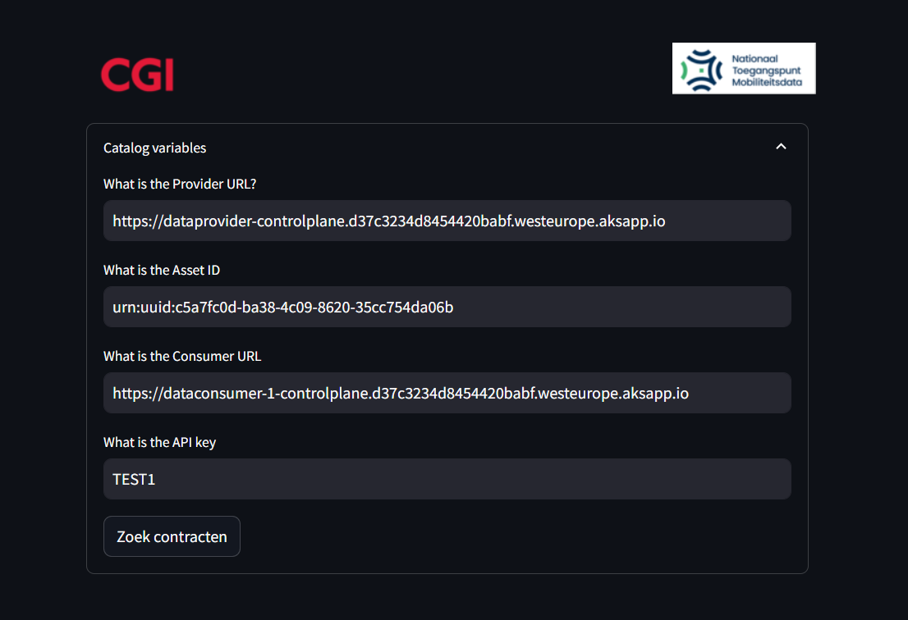

#### 2º- Policy Selection

A catalog will be displayed and the policies to be negotiation will be filtered, allowing the user to accept the policy:

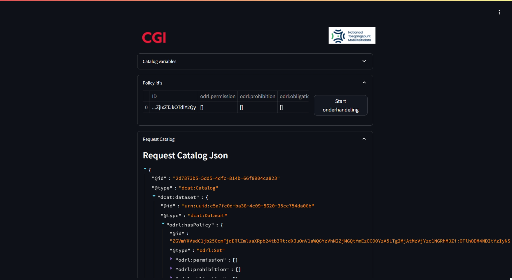

#### 3º- Start Negotiation

Once the user click in **"Start oderhandeling"** the contract negotiation will start!
And then when the negotiation is over the tranfer phase will begin:

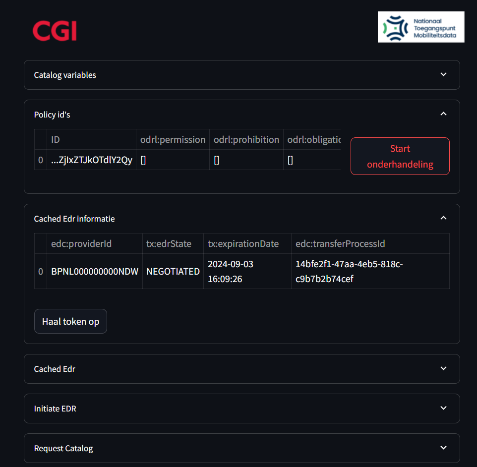

#### 4º- Transfer to get token

By clicking in **"Hall token op"** the wrapper will retrieve the Data Plane token to be used when transfering the data from the [data provider](#data-provider) to the [data consumer](#data-consumer).

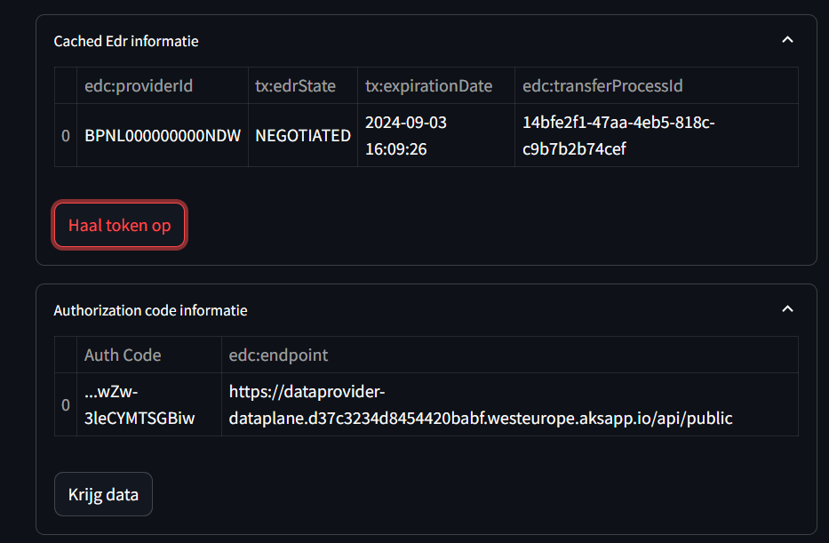

#### 5º- Use token to get the data

Finally by clicking in **"Krijg data"** the user will be able to retrieve the OTM data which is stored in the [data provider](#data-provider) [simple data service](#simple-data-service) in the desired data format, in this case OTM.

#### 6º- Download the data in JSON format

At the end the user can download the fill data in json format by clicking in **"Download full Json"**:

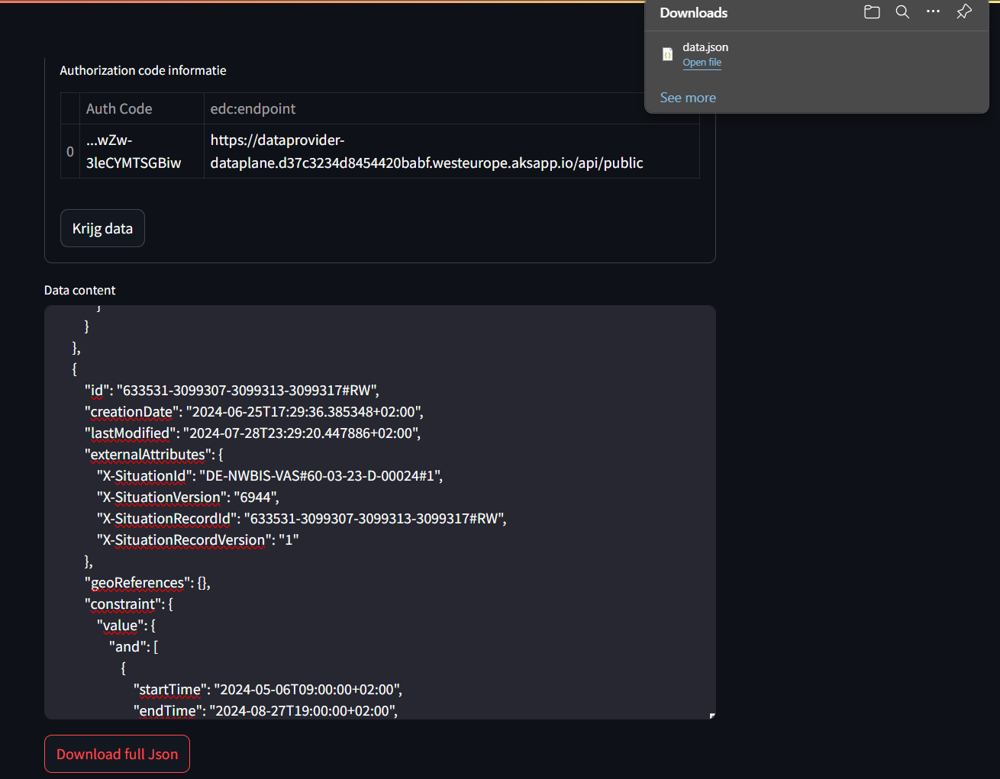
