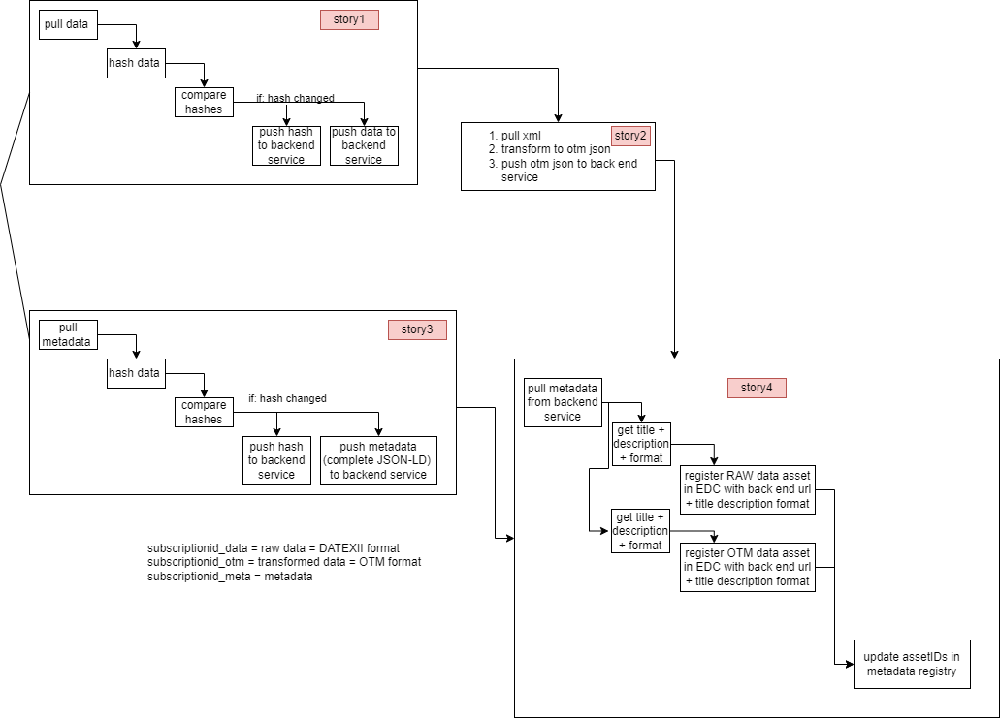
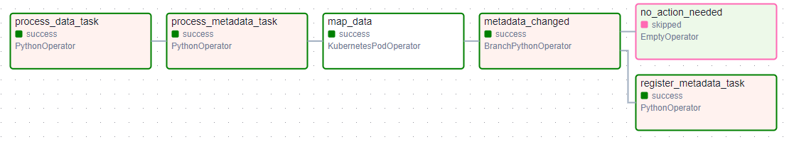

# Data Transformation Pipeline

## Introduction
This document describes the steps to the data transformation pipeline, to transform data into various formats. The pipeline is developed in an airflow DAG (Directed Acyclic Graph). The workflow is scheduled every 12 hours, it gets triggered after every 12 hours.

The following data formats are supported in the workflow:

* DATEXII
* OTM

### Accessibility:
* URL: https://airflow.d37c3234d8454420babf.westeurope.aksapp.io/dags/data_transformer
* username: admin
* password: admin


## Architecture



## Parameters


| Name                    | Description                            | Default Value                |
|-------------------------|----------------------------------------------------------------------------------------------------------------------------------|----------------------------------------------------------------------------------------------------------------------------------------------------------------------------------------------------------------------------------------------------------------------------------------------------------------------------------------------------------------------------------------------------------------------------|
| ***CERT_PASSWORD***          | The certificate password used to pull data.                                           |  **********                                                                                                                                                                                               |
| ***CERT_PATH***              | The certificate file path located to pull data.                                       | /opt/airflow/secrets/moblithek/certificate.p12                                                                                                                                                                                                                                                                                                                          |
| ***DATA_ENDPOINT***          | This endpoint is used to retrieve data from Mobilithek server.                        | [https://mobilithek.info:8443/mobilithek/api/v1.0/subscription/752571257922158592/clientPullService?subscriptionID=752571257922158592](https://mobilithek.info:8443/mobilithek/api/v1.0/subscription/752571257922158592/clientPullService?subscriptionID=752571257922158592)                                                                                                                                                                                                                                                                         |
| ***DATASERVICE_ENDPOINT***   | This endpoint is used to store metadata and data and based on unique subscription Id. | [https://data-service.d37c3234d8454420babf.westeurope.aksapp.io/api/752571257922158592](https://data-service.d37c3234d8454420babf.westeurope.aksapp.io/api/752571257922158592)   |
| ***EDC_API_KEY***   | EDC API Key used for authentication. | TEST1   |
| ***EDC_DATATRANSFER_ENDPOINT***   | The endpoint to retrieve the amount of data requests. | [https://dataprovider-controlplane.d37c3234d8454420babf.westeurope.aksapp.io/management/v2/transferprocesses/request](https://dataprovider-controlplane.d37c3234d8454420babf.westeurope.aksapp.io/management/v2/transferprocesses/request)   |
| ***EDC_ENDPOINT***   | The EDC provider endpoints to manage assets, policies and contract definitions. | [https://dataprovider-controlplane.d37c3234d8454420babf.westeurope.aksapp.io](https://dataprovider-controlplane.d37c3234d8454420babf.westeurope.aksapp.io)   |
| ***FRONTEND_URL***   | The frontend url to access the frontend demonstrator. | [https://frontend.d37c3234d8454420babf.westeurope.aksapp.io](https://frontend.d37c3234d8454420babf.westeurope.aksapp.io)   |
| ***METADATA_ENDPOINT***   | This endpoint is used to retrieve metadata of the data from Mobilithek server. | [https://mobilithek.info/mdp-api/mdp-msa-metadata/v1/export/dataset/dcat/608447464874934272/export](https://mobilithek.info/mdp-api/mdp-msa-metadata/v1/export/dataset/dcat/608447464874934272/export)   |
| ***NTM_BACKEND_URL***   | This endpoint is used to update asset ids and provider url to the ntm metadata registry. | [https://ntm-backend.d37c3234d8454420babf.westeurope.aksapp.io/data-publications/efdf4ed7-7c74-49da-a3c3-16fb41124e06](https://ntm-backend.d37c3234d8454420babf.westeurope.aksapp.io/data-publications/efdf4ed7-7c74-49da-a3c3-16fb41124e06)   |

## Steps



The pipeline contains 6 steps/tasks, and each step performs certain action items and get executed in order.

### 1. Process Data

The process data task fetches data and track the history of its changes using Hash technology. 

**Pull Data:** Pulls DATEXII formatted data from Mobilithek server in XML

**Hash Data:** Compute and create a hash of the data to compare against the previously pulled data (if any)

**Compute Hashes:** Compute a hash of data using **SHA256** encoding scheme.

**Push Hash to Backend:** Store computed hash to the backend service.

> Endpoint: https://data-service.d37c3234d8454420babf.westeurope.aksapp.io/api/hash/{subscriptionId}_data

SubscriptionId: `752571257922158592`

**Example Hash**
```bash
0b223a27467ee763d81a25525c251fd0711bc1b4f05dd852faf118560c99d930
```

**Push Data to Backend:** Store data to the backend service.

> Endpoint: https://data-service.d37c3234d8454420babf.westeurope.aksapp.io/api/{subscriptionId}_data

SubscriptionId: `752571257922158592`

### 2. Process Metadata

The process metadata task fetches metadata and track the history of its changes using Hash technology. 

**Pull Metadata:** Pulls metadata from Mobilithek server in JSON format

**Hash Metadata:** Compute and create a metadata hash to compare against the previously pulled metadata (if any).

**Compute Hashes:** Compute a metadata hash using **SHA256** encoding scheme.

**Push Hash to Backend:** Store computed hash to the backend service. 

> Endpoint: https://data-service.d37c3234d8454420babf.westeurope.aksapp.io/api/hash/{subscriptionId}_meta

SubscriptionId: `752571257922158592`

**Example Hash**
```bash
2fbe630f79602ed0813521022bfec279e5511990f00bae59fe450b5020ecaadd
```

**Push Metadata to Backend:** Store metadata content to the backend service.

> Endpoint: https://data-service.d37c3234d8454420babf.westeurope.aksapp.io/api/{subscriptionId}_meta

SubscriptionId: `752571257922158592`


### 3. Map Data

This task processes mapping of data, that was fetched from the backend service and transforms it into OTM format.

**Pull XML:** Fetches data from the backend service, stored in previous steps.

**Transform to OTM JSON:** Transforms data from DATEXII to OTM format.

**Push OTM JSON to Backend:** This action stores transformed data in OTM format to the backend data service.

> Endpoint: https://data-service.d37c3234d8454420babf.westeurope.aksapp.io/api/{subscriptionId}_otm

SubscriptionId: `752571257922158592`

### 4. Metadata Changed:

This task does not do any transformation, instead performs branching between the next two steps `Register Metadata` and `No Action Needed`. It checks if the metadata content has changed since the last pull. If content has changed, the `Register Metadata` gets triggered, else there is `No Action 'Needed` and hence nothing happens. 

### 5. Register Metadata:

This task gets triggered when the metadata content has changed. It creates/updates one EDC asset for **DATEXII** and  one for **OTM** data. Besides this, it also creates a default policy and contract definition if they are not already existed.

**Pull Metadata from Backend:** Pull metadata from the backend data service

**Get Title and Description:** Extract title and description from metadata content and put them into the EDC Datex asset payload.

**Register Datex Dataset in EDC**

This action registers a new EDC DATEXII asset or updates the exisitng one if it already exists with the title and description.

> Endpoint: https://dataprovider-controlplane.d37c3234d8454420babf.westeurope.aksapp.io/management/v3/assets/request


**Get Title and Description:** Extract title and description from metadata content and put them into the EDC OTM asset payload.

**Register OTM Dataset in EDC**

This action registers a new EDC OTM asset or updates the exisitng one if it already exists with the title and description.

> Endpoint: https://dataprovider-controlplane.d37c3234d8454420babf.westeurope.aksapp.io/management/v3/assets/request

**Update Asset Ids in Metadata Registry**

Finally, the the asset Ids and publication Url is updated into the Metadata Registry

> Endpoint: https://ntm-backend.d37c3234d8454420babf.westeurope.aksapp.io/data-publications/{publicationId}

publicationId: `efdf4ed7-7c74-49da-a3c3-16fb41124e06`

### 6. No Action Needed

This task does nothing and relies on the decision from `Metadata Changed` Task

